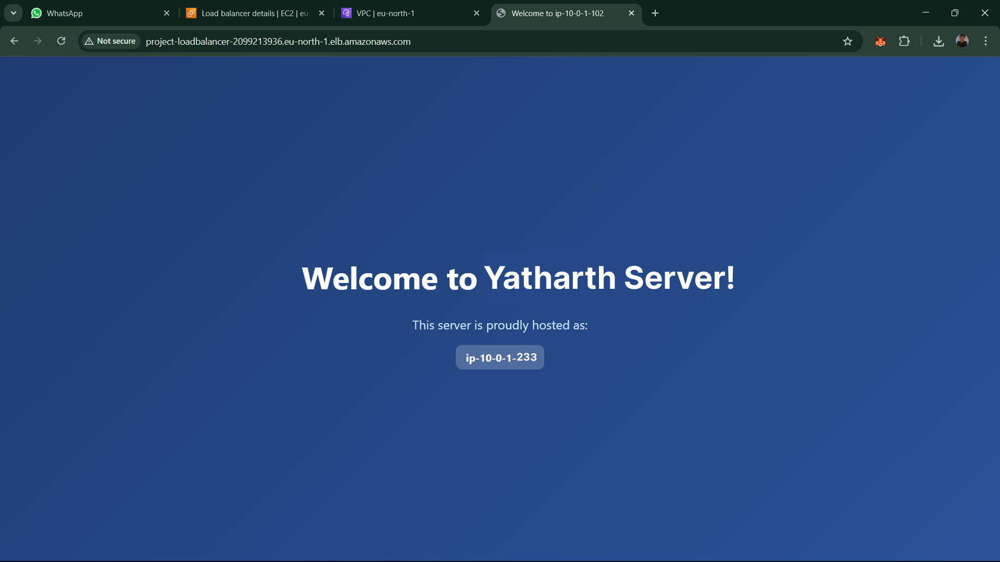

# AWS Project Implementation -- Yatharth Barrendia {#aws-project-implementation-yatharth-barrendia}

## Step 1: Launch EC2 Instances Using a Bash Script

- Go to the [AWS EC2 Console](https://console.aws.amazon.com/ec2)

- Click on **Launch Instance**

- Fill in the details:

- **Name**: server-1, server-2, server-3

- **Amazon Machine Image (AMI)**: Select **Ubuntu Server 24.04 LTS
  (HVM), SSD Volume Type**

- **Instance type**: t3.micro (Free Tier eligible)

- **Key pair**: Create new key-pair name (yatharth)

- **Network Settings**: Created VPC (project-vpc)

- **Security Group:** server-1

- **Type**: HTTP \| **Protocol**: TCP \| **Port**: 80 \| **Source**:
  Anywhere (0.0.0.0/0)

- **Type**: SSH \| **Protocol**: TCP \| **Port**: 22 \| **Source**: My
  IP

- **User Data contains:** \"Welcome to Yatharth Server!\"

  

  

 

  

  

  

## USER DATA:

userdata.sh

  

Similarly create three servers: server-1, server-2 and server-3
respectively

  

## Step 2: Create a Target Group and Register EC2 Instances

- Target Group Name: \`Project-TargetGroup\`

- Target Type: Instances

- Port: 80

- Register EC2 instances: \`server-1\`, \`server-2\`, \`server-3\`

 

  

  

  

  Verify Registration

- After creation:

<!-- -->

- Go back to **Target Groups**

- Select your newly created target group

- Click on the **Targets** tab

- You should see the EC2 instances with a **healthy** status after a few
  seconds (if health checks pass)

 

  

## Step 3: Create Application Load Balancer

- Name: Project-LoadBalancer

- Type: Application Load Balancer (ALB)

- Security Group: \`ALB-Security\`

- Listener: HTTP on port 80

- Associated Target Group: \`Project-TargetGroup\`

 

  

  

  

  

## Step 4: Configure Security Groups

- ALB-Security SG: Allow HTTP from \`0.0.0.0/0\`

- server-1 SG: Allow HTTP from \`ALB-Security\`

  

  

  

## Step 5: Final Verification

- Copy the DNS name of ALB: \`Project-LoadBalancer\`

- Paste in browser: Should show "Welcome to Yatharth Server!" page

  

  

  

 
  Hurray!! We are getting response from all three servers.
